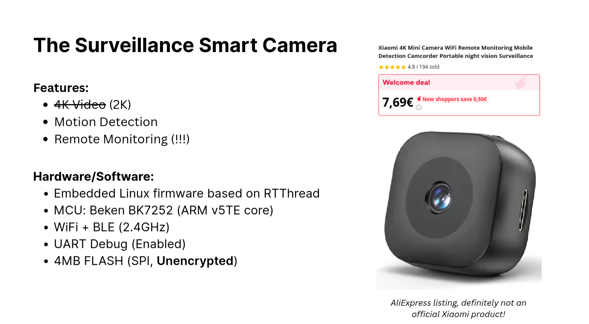
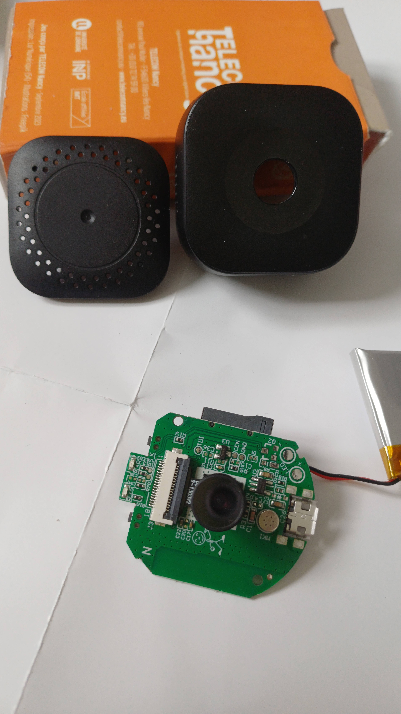
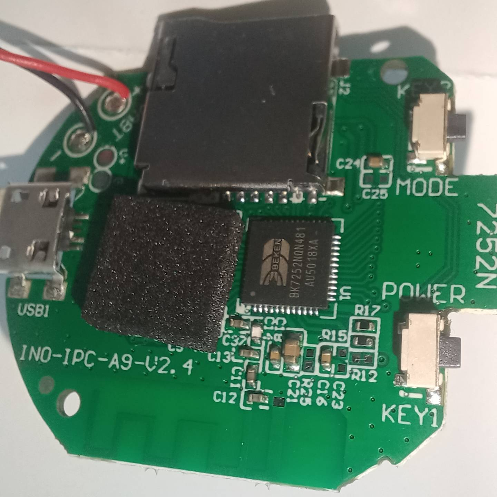
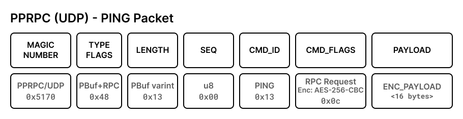

The Internet of Things, what a wonderful concept. Connecting everyday devices to the internet to make 
our lives more convenient. From smart thermostats to connected dishwashers, it seems the industry is 
ready to push any device online, whether it makes sense or not. But with connectivity, we all know
new challenges arise, and especially security becomes a major concern. *Hopefully, nobody will ever
try to hack my smart toaster, **right?***

Unfortunately, attackers are well aware of those new devices and their often poor security. It is no
wonder that recent DDoS attacks have not been launched from botnets of compromised computers, but
from very cheap and especially widely deployed IoT devices like cameras and routers. Even if their 
capabilities are limited, their sheer number makes them an attractive target. One vulnerability and 
you get an army of devices under your control.

> 
> <center><a href="https://xkcd.com/1966/">xkcd: Smart Home Security</a></center>

Multiple IoT botnets have been discovered in the recent years, like [Mirai](https://en.wikipedia.org/wiki/Mirai_(malware))
and [Hajime](https://en.wikipedia.org/wiki/Hajime_(malware)). Both of them are still active and actively
infecting new devices. **The most common attack vector is still the use of default credentials**, which
many users do not change after setting up their devices. Unfortunately, without real actions from
the device manufacturers, this will likely not change in the near future. But it shows well that 
**security is not their priority and if anything just an afterthought**.

## Our Target 

Last year, I got the chance to study at the [University of Twente](https://www.utwente.nl/en/) for a semester, and 
as part of one of my courses[^SSIoT] sponsored by the Dutch Domain Registration Authority[^SIDN], we had to analyze an IoT device of our choice.
The goal was to perform a quick security analysis of the device, based on their network traffic and report how they operated.

Our device of choice, here, is a very cheap "surveillance camera" bought on the amazing marketplace that is AliExpress. 
For the low, low price of 9€, this camera supposedly offers 4K video recording, night vision, motion detection and full remote control.
Also it is ***an amazing no-name device***, which is definitely not manufactured by Xiaomi.  
Well, as you can imagine, night vision and 4K video are not actually there, but hey, for 9€ you cannot expect much.
**But what about security? Are we up for a good surprise?**

> 
> <center>Specifications and listing of the device, <em>slide of the final report.</em></center>

## Time for some network traffic capture

The setup[^NetworkCapture] is simple: we used a Raspberry Pi as a WiFi access point, all the traffic going through it will be captured using `tcpdump`.
The camera and the smartphone with the companion app are connected to this access point, so we can analyze all the traffic between them.

After setting up the camera for the first time (with a very buggy and not really comforting app), I started to capture traffic samples
of the camera being turned on, streaming video, being idle, and being turned off. At first glance, the traffic does not look horrible:

* The camera uses DHCP to get an IP address
* It does not seem to use any DNS servers nor NTP servers
* It connects directly to a few servers in Germany, hosted by Alibaba Cloud using TCP and UDP on various ports.
* It seems the camera uses custom protocols over the standard ports 80 (HTTP) and 53 (DNS). it might help to bypass firewalls.
* Otherwise, communication with the app is done over UDP using random ports.
* Finally, it seems that all communications are actually encrypted, as no cleartext traffic could be observed and the entropy of the traffic is high.

After those first attempts, it would be easy to conclude that the device seems to be actually thought with some security in mind. 
That said, we can note that **no standard protocols are used** (and especially no TLS), so actually the traffic might be encrypted, but we do not know how well.

## Digging deeper

From this initial analysis, we only know where the traffic goes, but not really much about the protocols used.
Going further, we can try to reverse engineer the app and the camera firmware to get more information.

### The messy app

The official app for this camera is [Linklemo](https://play.google.com/store/apps/details?id=com.xcthings.fchan).  
For some reason, the developer declared on the Play Store is "TRIGRASS IOT Technology", but the actual package name is `com.xcthings.fchan` which 
seems to be related to [XC Things](https://www.xcthings.com), a Chinese company making various IoT devices. In any case, it seems more plausible, that 
XC Things is the actual company behind this camera software.

The app itself is a complete mess:

* It is full of third-party libraries, with numerous Adversing SDKs, Analytics SDKs from 
the traditional big players (Google, Facebook, etc.) and the Chinese ones (Tencent, Alibaba, Huawei, etc.).
* It is actually a Flutter app, but with actually 3 layers of abstraction: Flutter and Dart for the main UI, lots of Kotlin code and finally a big Golang library that runs most of the communication with the camera.

Reversing the app seems actually quite hard, with 3 different codebases and tooling that is currently quite lacking for Dart and Golang.
Knowing my limit, I look for an easier target: the camera firmware.

### The firmware

**Finding the firmware is surprisingly quite easy.**
Just opening the camera package, it reveals the PCB name `INO-IPC-A9-V2.4`. A quick search on Google leads you 
to a German website with the exact same camera, named [Pinmei A9](https://www.elektroda.com/news/news4118499.html).

Fortunately for us, the firmware is really easy to dump from the camera, the SPI flash chip is directly accessible on the PCB and
can be read using a simple SPI programmer. Moreover, it is not encrypted (nor does it seems to be signed).

Someone else already did the hard work and provided the firmware dump on GitHub and it just need a little bit of work to extract the actual
program[^CRCFirmware] and be able to analyze it using Ghidra.



## Remote Procedure Call

And there again, you are a bit lost. The firmware comes with a lot of functions. But some names starts to look familiar,
`xcthings`, `pprpc`, `avsdk`. The first one seems to confirm that XC Things is indeed the company behind the software.

The latter two are more interesting. `avsdk` seems to be a library for Audio/Video streaming, but `pprpc` is something else.
That said `RPC` stands generally for Remote Procedure Call, a way to call functions on a remote system, which would be the perfect place
to look for the camera communication protocol.

```
pprpc_packet_decrypt_ctrlpayload
pprpc_packet_decrypt_filepayload
pprpc_packet_decrypt_mediaexdata
pprpc_packet_encrypt_ctrlpayload
pprpc_packet_encrypt_filepayload
pprpc_packet_encrypt_mediaexdata
```

Fortunately for us, lots of functions related to `pprpc` also include `packet` and even `encrypt` or `decrypt` in their names. This is definitely
the right place to look.

However, it seems that `pprpc` is a custom protocol developed by XC Things, as no information is available online. **Except that a [GitHub organization](https://github.com/pprpc) exists,** with the same name. Even better, it contains repositories for Golang libraries and some of those earlier mentioned functions are actually implemented there with some additional Chinese documentation. ***Jackpot!***

Let's look at the encryption scheme then.

> ```go
> // GetCryptoKey get cryptoKey.
> func (cmd *CmdPacket) GetCryptoKey() {
> 	//md5(fmt.Sprintf("%s,ID:%d-SEQ:%d-RPC:%d", "P2p0r1p8c0622",cmd.CmdID, cmd.CmdSeq, cmd.RPCType))
> 	_t := fmt.Sprintf(",ID:%d-SEQ:%d-RPC:%d", cmd.CmdID, cmd.CmdSeq, cmd.RPCType)
> 	cmd.Md5Byte = []byte{}
> 	cmd.Md5Byte = append(cmd.Md5Byte, cmd.Key...)
> 	cmd.Md5Byte = append(cmd.Md5Byte, []byte(_t)...)
> 	cmd.EnKey = []byte(ppcrypto.MD5(cmd.Md5Byte))
> }
> ```
> [Source -- `packets/cmd_packet.go` -- pprpc/core](https://github.com/pprpc/core/blob/master/packets/cmd_packet.go#L150-L158)

***Is that a hardcoded key?*** **Yes, yes it is.** But fortunately, it does not seem to work for my device.  
*Hopefully, this hardcoded key, abandoned in a 5 year old repository, is no longer in use...*

That said, this pattern string should be easy to find in the firmware, *isn't it?* And indeed it is.

Using Ghidra, we can just look for the string `,ID:%d-SEQ:%d-RPC:%d`, which is referenced one time in the whole binary. This location is also referenced by a function elsewere, we can just jump to it. And looking around the other arguments used by the formatting function, we can find the hardcoded secret in the firmware dump.

> So, yes, the secret is in fact hardcoded in the firmware. But it could be worse, nobody is really supposed to have access to it?

Well well well, this secret enables me to decrypt traffic from the camera who has been dumped, but also mine and even worse another camera which is similar but not the exact same model.  
**All that to say, they reuse the same secret for all camera!**

> Hmm, this is bad...

But it is even worse, you don't need to own a camera to get access to this secret, **the secret is also hardcoded in the official app.** Everyone is able to decrypt the traffic of all those camera.

> What's the point of encryption then?

Well, apparently it is just for the appearance of it. They would have done a better job at securing all the traffic by simply using TLS, *especially since a TLS library is already present in the firmware (`mbedtls`)*.

## Communicating with the camera

Let's recap where we are in this "investigation":

* PPRPC is the protocol used by the camera to communicate with its servers.
* We found the secret used for the PPRPC encryption scheme.
* We still want to know what kind of data is actually transfered using PPRPC.

### PPRPC - How does that work?

We knew already that the camera used UDP and TCP sockets for communications on various ports. Well, for all of those communications, it turns out that PPRPC is the Application protocol used.

This proprietary protocol is actually used as a low level protocol to interact with various services, as the GitHub source codes reveal.
In the case of the camera, it is used for pub/sub messaging (like MQTT), user/device/server discovery, and also to relay video streams or files. 

The app also highly relies on the PPRPC protocols for both communications with the camera and the home servers. But an extra security layer (TLS) is present for the latter.
*At least my payment information might be a little more secure? (Have I already mention that they offer a Cloud-based subscribtion service?)*

#### RPC Packets

 

Packets in the PPRPC protocol always start by a common header. It contains a Magic number (only for UDP packets), a packet type (and some flags for the encoding) and the remaining length of the packet.

Depending on the Packet Type, additional headers are introduced and the encoding of the payload might be influenced. For RPC, Audio/Video and File Transfer packets, the encryption of the payload is defined in those additional headers.

#### Encryption scheme

***TODO: WIP***

[^SSIoT]: "Security Services for the Internet of Things", a Master course at the University of Twente. Resources available on [their website](https://courses.sidnlabs.nl/ssi-2025/) if you are curious.
[^SIDN]: SIDN is the Dutch operator of the top-level domain, `.nl`, [more info on their website](https://www.sidn.nl/en/).
[^NetworkCapture]: The Network Traffic Capture setup using OpenWRT on a Raspberry Pi is described in detail [in a dedicated GitHub repository](https://github.com/fusetim/ssi-openwrt-setup).
[^CRCFirmware]: The firmware dump has been made directly from the memory chip. It contains CRC16 checksums that need to be removed before analysis (34 Bytes = 32 bytes + 2 CRC bytes).
